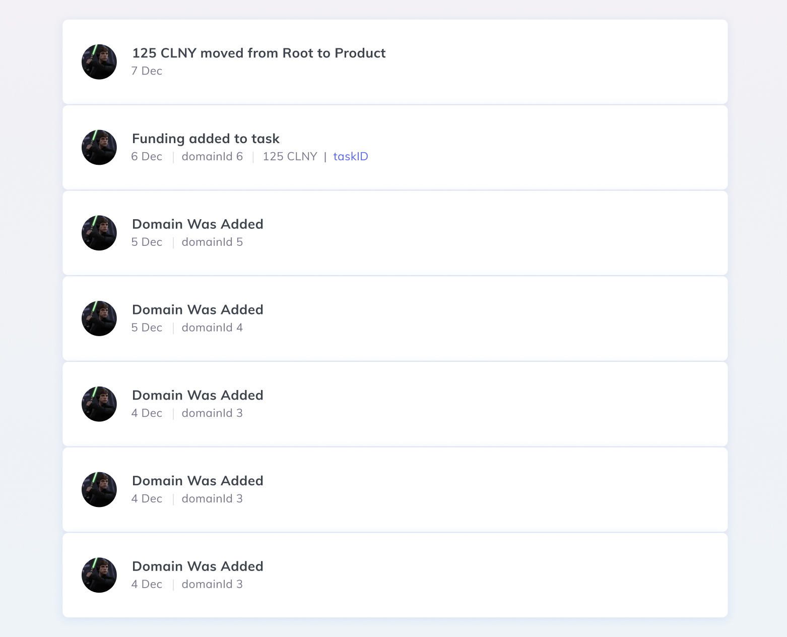

# Colony Coding Challenge

Your task for this challenge is to build a simple events list display. I looks something like this:



The page you'll be creating just displays the list of formatted event data in a _(mostly)_ non-interactive way, sorted in a certain way.

## Stack

We expect this task to be completed using [React](https://reactjs.org/), [CSS Modules](https://github.com/css-modules/css-modules) and [Typescript](https://www.typescriptlang.org/)

For this, we suggest using [`create-react-app`](https://reactjs.org/docs/create-a-new-react-app.html), but we won't hold it against you if you preffer to set up the enviroment yourself, as long as it meets the above criteria.

The additional external libraries you'll need to complete this will be detailed in the appropriate section(s).

## Design

The design specs provided are orientative, as we won't count the exact pixels, but do try to make them as close as possible _(going by both the below specs and the provided screenshot)_.

**Page**
- Background: grandient from `#f4f0f3` to `#eaf3f7`

**Events List**
- Width: `700`px
- Height: _dynamic_
- Shadow: `rgba(62, 118, 244, 0.14)` _(use your own appreciation skills to determine the appropriate offsets)_
- Forms of pagination _(infinite scroll, load more, etc)_ will be appreciated, but are not required

**List Item**
- Height: `90`px
- Padding top, bottom: `26`px
- Padding left, right: `20`px
- Background: `white`
- Border-radius: `6`px
- Background Hover State: _should be existent, but it's up to you what color / effect you choose to apply to it_

**Avatar**
- Width, Height: `37`px
- Border Radius: _enought to create a circle_

**Copy**
- Font family: [Muli](https://www.fontsquirrel.com/fonts/muli) or [Mulish](https://fonts.google.com/specimen/Mulish)
- Font weight regular: `400`
- Font weight heavy: `700`
- Font size primary: `14`px
- Font size secondary: `12`px
- Forms of variable length handling will be appreciated _(eg: ellipsis)_

## Data

The events and logs you'll be using come from the [Colony Network](https://github.com/JoinColony/colonyNetwork) smart contracts deployment on the Ethereum Mainnet.

To make access easy to the above data, we've built an open-source library that interacts with the network contracts and which provides a more easy to use experience: [colonyJS](https://github.com/JoinColony/colonyJS).

### Events

From all the events available to us, you'll just be displaying the following four events:
- [ColonyInitialised](https://github.com/JoinColony/colonyNetwork/blob/develop/contracts/colony/ColonyDataTypes.sol#L24-L27)
- [ColonyRoleSet](https://github.com/JoinColony/colonyNetwork/blob/develop/contracts/colony/ColonyDataTypes.sol#L39-L44)
- [PayoutClaimed](https://github.com/JoinColony/colonyNetwork/blob/develop/contracts/colony/ColonyDataTypes.sol#L39-L44)
- [DomainAdded](https://github.com/JoinColony/colonyNetwork/blob/develop/contracts/colony/ColonyDataTypes.sol#L180-L182)

**ColonyInitialised**

_Event logged when Colony is initialised_

Required display data and copy:
- Primary:  Congratulations! It's a beautiful baby colony!
- Secondary: _Formatted event date_

Expected event values: [ColonyDataTypes.sol#L25-L26](https://github.com/JoinColony/colonyNetwork/blob/develop/contracts/colony/ColonyDataTypes.sol#L25-L26)

**ColonyRoleSet**

_Event logged when a user/domain/role is granted or revoked_

Required display data and copy:
- Primary:  **${role}** role assigned to **${user}** in **${domainId}**.
- Secondary: _Formatted event date_

Expected event values: [ColonyDataTypes.sol#L40-L43](https://github.com/JoinColony/colonyNetwork/blob/develop/contracts/colony/ColonyDataTypes.sol#L40-L43)

**PayoutClaimed**

_Event logged when reward payout is claimed_

Required display data and copy:
- Primary:  **${userAddress}** collected Rewards from **${rewardPayoutId}**.
- Secondary: _Formatted event date_

Expected event values: [ColonyDataTypes.sol#L68-L71](https://github.com/JoinColony/colonyNetwork/blob/develop/contracts/colony/ColonyDataTypes.sol#L68-L71)

**DomainAdded**

_Event logged when a new Domain is added_

Required display data and copy:
- Primary:  **${domainId}** added.
- Secondary: _Formatted event date_

Expected event values: [ColonyDataTypes.sol#L181](https://github.com/JoinColony/colonyNetwork/blob/develop/contracts/colony/ColonyDataTypes.sol#L181)

### Fetching Events Data

To fetch the required data for the above events you'll be making use of our open source library [colonyJS](https://github.com/JoinColony/colonyJS), as well as a few others that are required to connect to the ethereum network.

Install the latest **version 2** of [`colonyJS`](https://github.com/JoinColony/colonyJS): `npm install @colony/colony-js@2` which you require in order to make use of the Colony network contracts.

Install the latest **version 4** of [`ethers.js`](https://github.com/ethers-io/ethers.js/): `npm install ethers@4` which you require for a wallet, as well as for a provider which will help you connect to the ethereum mainnet.

If you require docs for `v4` of `ethers`, you can find them here: https://docs.ethers.io/v4/

**Getting the Colony Client**

The events data that you'll be using comes from the [`Betacolony`](https://colony.io/colony/beta) colony that is deployed to mainent. For this you will require an `colonyClient` instance.

Here is how you can get one:

```js
import { getColonyNetworkClient, Network, getLogs, getBlockTime } from '@colony/colony-js';
import { Wallet } from 'ethers';
import { InfuraProvider } from 'ethers/providers';

// Set up the network address constants that you'll be using
// The two below represent the current ones on mainnet
// Don't worry to much about them, just use them as-is
const MAINNET_NETWORK_ADDRESS = `0x5346D0f80e2816FaD329F2c140c870ffc3c3E2Ef`;
const MAINNET_BETACOLONY_ADDRESS = `0x869814034d96544f3C62DE2aC22448ed79Ac8e70`;

// Get a new Infura provider (don't worry too much about this)
const provider = new InfuraProvider();

// Get a random wallet
// You don't really need control over it, since you won't be firing any trasactions out of it
const wallet = Wallet.createRandom();
// Connect your wallet to the provider
const connectedWallet = wallet.connect(provider);

// Get a network client instance
const networkClient = await getColonyNetworkClient(
  Network.Mainnet,
  connectedWallet,
  MAINNET_NETWORK_ADDRESS,
);

// Get the colony client instance for the betacolony
const colonyClient = await networkClient.getColonyClient(MAINNET_BETACOLONY_ADDRESS);
```

**Getting the Event Data**

Now that you have the `colonyClient` instance, you can use it to filter out the logs of just the events that you need.

Note that this example only covers this for one event type, as the process is the same for  of them.

```js
// Get the filter
// There's a corresponding filter method for all event types
const eventFilter = colonyClient.filters.PayoutClaimed();

// Get the raw logs array
const eventLogs = await getLogs(colonyClient, eventFilter);
```

The above will get you the raw logs data, but to make sense of the data you need to parse them. To do this, you have to run each entry in the event logs array trough the `colonyClient.interface.parseLog()` parser method.

Something like this:
```js
const parsedLogs = eventLogs.map(event => colonyClient.interface.parseLog(event));
```

**Handling User Addresses**

User addresses should be used as-is, not parsing or mapping necessary

**Handling User Roles**

User roles will be returned as `integer` values. the [`colonyJS`](https://github.com/JoinColony/colonyJS) library includes a mapping that you can use for this:

```js
import { ColonyRole } from '@colony/colony-js';

// This object includes a mapping of role ids to names
console.log(ColonyRole);
```

**Handling Token Symbols**

One of the events you will have to handle includes displaying payouts in various tokens. The parsed event data will only give you a token's address.

It is up to you to look up tokens on [Etherscan](https://etherscan.io/tokens) _(or another block explorer)_ and create a manual, local mapping between token addresses and token symbols.

**Handling Numbers**

The biggest challenge here is to handle and parse numbers, since all number values are returned as `hexadecimal string` value of an [`BigNumber`](https://github.com/indutny/bn.js/) instance.

The `ethers.js` library you just installed already contains a [`BigNumber` util](https://docs.ethers.io/v4/api-utils.html#big-numbers), so we're going to make use of that:

```js
import { utils } from 'ethers';

const [singleLog] = parsedLogs;

// Create a new BigNumber instance from the hex string amount in the parsed log
const humanReadableAmount = new utils.BigNumber(singleLog.values.amount);

console.log(humanReadableAmount.toString());
// or
console.log(humanReadableAmount.toNumber());
```

Note that most values you'll get back in logs are more then `53`bits in size so if you will try to convert them to an `integer` _(ie: use `.toNumber()`)_ it will throw an error.

You can safely assume the payout amounts for all tokens have `18` decimal places, meaning that amount values will have to be divided by `10` to the power of `18` _(`10**18` or `1` followed by `18` zeros)_

Here's an example converting the value:

```js
// Get a base 10 value as a BigNumber instance
const wei = new utils.BigNumber(10);

// The converted amount is the human readable amount divided by the wei value raised to the power of 18
const convertedAmount = humanReadableAmount.div(wei.pow(18));

// If you are confident that it's a a low enough value, you can display it as an integer -- .toNumber()
// But to be on the safe side, you can also use it as a string
console.log(convertedAmount.toString());
```

Note that you will not be judged to harshly on your number conversions, but accurate values will represent be appreciated.

**Getting the date**

Events themselves won't provide you with a date, but there's a way of fetching it using a method called `getBlockTime`, which can be imported from `@colony/colony-js`:

```js
import { getColonyNetworkClient, Network, getLogs, getBlockTime } from '@colony/colony-js';

const [singleLog] = parsedLogs;

// Use the blockHash to look up the actual time of the block that mined the transactions of the current event
const logTime = await getBlockTime(provider, singleLog.blockHash);

```

### Formatting the data

The list you will end up with, after you parse it and concatenate it, should:
- contain all the events you filtered out _(roughly between 150-300 items, depending on when you fetch them)_
- be sorted reverse chronological _(newest at the top)_
- contain all the values required in the copy

The final object/data format you end up with is up to you.


## Submitting results

